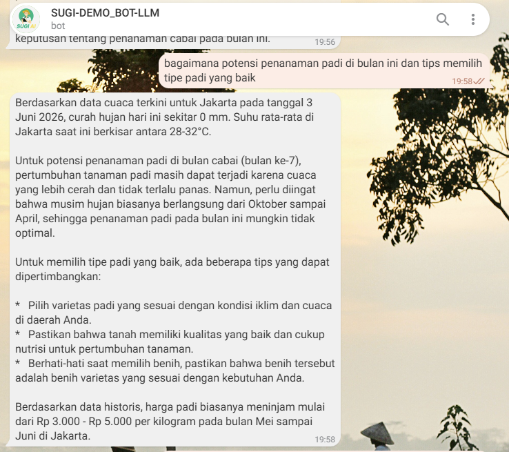
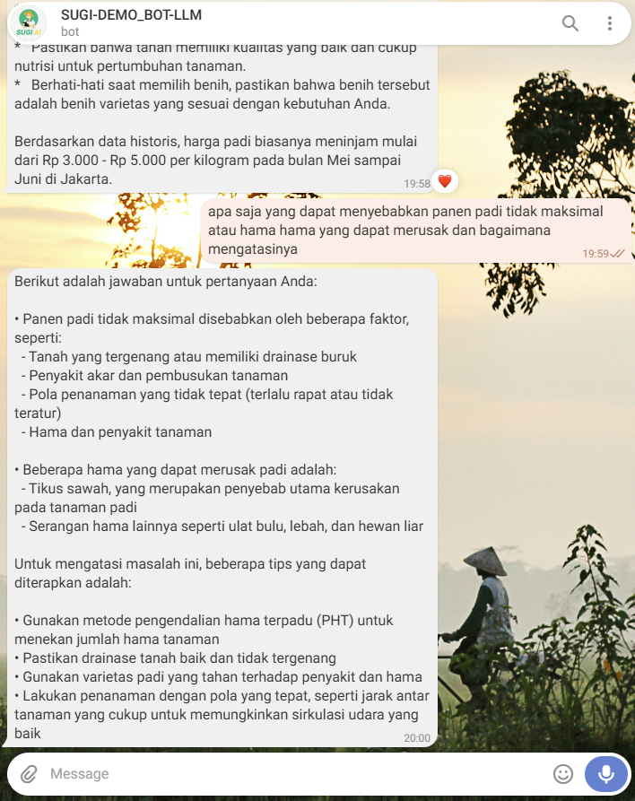
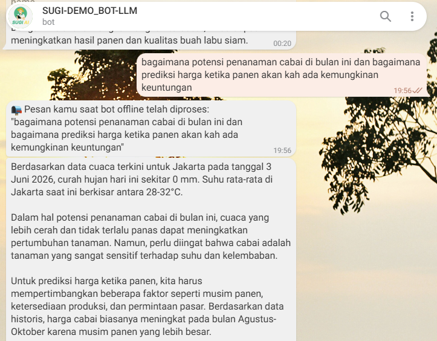

# 🌾 SUGI v0.1L – Intelligent Agricultural Assistant (Indonesia)

An AI-powered RAG assistant specifically designed for farmers, growers, government officials, and agribusiness players in Indonesia & Southeast Asia.

[](https://www.python.org/)
[](https://ollama.com/)
[](https://python.langchain.com/)
[](https://www.trychroma.com/)
[](https://www.mongodb.com/)


## 📱 Live Demo

You can try the SUGI AI chatbot live on Telegram:
👉 **[Chat with @sugi_demo_llmbot on Telegram](https://t.me/sugi_demo_llmbot)**

<p align="center">
  
</p>

## 📸 Interface Previews

Here is SUGI AI in action on Telegram:

<p align="center">
  
  
  
</p>

## 🔥 Main Features

- **Hybrid RAG** → BM25 + Dense Vector (mxbai-embed-large) + Cross-Encoder Reranker  
- **Multi-Platform** → CLI interface & **Telegram Bot Integration**  
- **Dynamic Retriever** → Automatic weighting based on query type (plant/weather/history)  
- **3-Layer Query Rewriting** → rule-based (0ms) → Qwen2.5 fallback (~800ms) → original query  
- **Definitional Query Detection** → Phrases like "apa itu X" / "what is X" skip rewriting to prevent false topic injection.  
- **Rewrite-Type Scope Gating** → Only suffix-based rewrites (e.g., "menanamnya" → "menanam semangka") can bypass scope; word replacements cannot inject agriculture keywords into unrelated queries.  
- **High Performance (Try 2 Times)** → History limited to 2 turns & Retrieval k=2 for near-instant responses.
- **Real-time Agricultural Data**  
  - Daily weather + agronomic alerts (drought, flood, heat stress, disease) from Open-Meteo  
  - Complete plant information (species, pests, diseases, care guides) via Perenual API  
  - **Fast Failure API** → Fails in <1s if rate limited (429), immediately falling back to local RAG data.
  - Automatic indexing for CSV/XLSX/PDF (commodity prices, cultivation guides, etc.)  
- **Stability Guard** → 8,000 character truncation & 4,096 context window to prevent overflow errors.
- **Embedding Safety** → Automatically truncates long documents (>2,000 chars) before storage to fit embedding model limits. Failed embeddings are caught gracefully without crashing.
- **Long-term Memory** → Session summaries stored in ChromaDB for multi-turn context  
- **Daily Insight Engine** → Sends daily insights to MongoDB every 12 hours (regional prices, weather, planting tips, policies).
- **Government Insight Engine** → AI-generated strategic insights from 14 government datasets (prices, food security, distribution) with ChromaDB learning loop. Polls every 3600s.
- **Farmer Insight Engine** → 10 AI-generated farmer insights (Skor PPH, Komoditas Terbaik, Margin Positif, Surplus Pangan, Peluang Bulanan, Rekomendasi Tanam/Jual, dll.) + 1 Government Policy Recommendation. Uses example-driven prompting, multi-stage validation (Bahasa Indonesia, no truncation, no prefixes), retry on failure, and full SUGI ecosystem enrichment (RAG, weather, plant API, ChromaDB memory). Change detection with daily refresh.
- **INI-based Configuration** → All keywords & plant maps in `config/settings/`, no code changes needed.
- **Scope Guard** → Only answers agriculture & plantation related topics.  
- **Offline Message Catch-up** → Telegram bot processes messages sent while offline on restart, with crash-safe offset persistence.

## Tech Stack

| Component | Detail |
|---|---|
| **Primary LLM** | Llama 3.2 personal-tuned → `sugi-v0.1L` (via Ollama) |
| **Utility Model** | `qwen2.5:1.5b` — query rewriting fallback, plant extraction, eval loop, insights |
| **Embedding** | `mxbai-embed-large` (Ollama) |
| **Vector Store** | ChromaDB Server mode — 4 collections |
| **Retriever** | Ensemble (BM25 + Vector) + Cross-Encoder reranker (`ms-marco-MiniLM-L-6-v2`, top_n=5, k=2-8) |
| **Insight DB** | MongoDB Atlas — 7 collections across `sugi_insights` + `test` databases (write-only) |
| **External APIs** | Open-Meteo (Free weather), Perenual (Plants & Pests) |
| **Framework** | LangChain, LangChain-Classic |

---

## 🗄️ Database Schema

### ChromaDB (4 collections — READ/WRITE)

| Collection | Size | Source | Write Trigger | Read Trigger | Schema |
|-----------|------|--------|---------------|--------------|--------|
| `main_dataset` | Dynamic | `vectorCSV.py`, `vectorpdf.py` | New CSV/XLSX/PDF file detected in `data/raw_dataset/` or `data/raw_pdfs/` | Every user query via ensemble retriever (k=4) | `{source, sheet?, row_id?, data_type, chunk_index, page_content}` |
| `weather_data` | ~109 daily summaries | `vectorWeather.py` | Every day change detected (loop every 300s) | Weather query detected → `similarity_search(k=8)` | `{source, location, date, fetch_date, page_content}` |
| `plant_data` | Per-plant cache | `plant_api.py` | Plant query → Perenual API fetch | Plant query detected → `similarity_search(k=3)` | `{source, cache_key, plant_id?, common_name?, image_url?, cached_at, page_content}` |
| `conversation_memory` | Per-user session summaries | `sugi_core.py` | Every 5 user questions → LLM-summarized | Every query (filter by user_id, k=2) + memory recall | `{source, user_id, session_id, timestamp, page_content}` |

### MongoDB (2 databases, 7 collections — WRITE only)

`sugi_insights` database written every 12 hours by `daily_insight.py`.  
`test.governmentinsights` + `test.farmerinsights` written by `government_insight_service.py` and `farmer_insight_service.py`.  
**Zero reads** from the application — data is consumed by external dashboards.

| Database | Collection | Doc Count | Service | Content |
|----------|-----------|-----------|---------|---------|
| `sugi_insights` | `price_insights` | ~45 | `daily_insight.py` | LLM-generated price analysis per province from ChromaDB price docs |
| `sugi_insights` | `weather_insights` | ~45 | `daily_insight.py` | LLM-generated weather analysis per location from weather_data |
| `sugi_insights` | `planting_suggestions` | ~400 | `daily_insight.py` | LLM-generated planting recommendations per commodity × season |
| `sugi_insights` | `general_insights` | ~45 | `daily_insight.py` | Top 3-5 policy/trend insights from kebijakan docs |
| `sugi_insights` | `session_summaries` | ~13 | `daily_insight.py` | Conversation session summaries from conversation_memory |
| `sugi_insights` / `test` | `governmentinsights` | ~15 | `government_insight_service.py` + `farmer_insight_service.py` | Per-collection insights + 1 policy recommendation |
| `sugi_insights` / `test` | `farmerinsights` | ~10 | `farmer_insight_service.py` | 10 farmer-focused market insights (pph_score, best_commodity, margin_status, etc.) |

### Local Files

| File | Purpose | Format | Read Trigger | Write Trigger |
|------|---------|--------|--------------|---------------|
| `data/logs/queries.jsonl` | Per-query audit log | JSONL (append) | `!debug`, `!flags`, `!session` commands | Every query processed |
| `data/logs/eval_flags.jsonl` | Flagged queries only | JSONL (append) | `!flags` command | When eval detects LOW faithfulness/relevance |
| `data/users.json` | User profiles | JSON | Startup, debug commands | Every user interaction |
| `data/telegram_offset.json` | Offline message offset | JSON | Telegram bot startup, `!offset` command | Every message processed (online + offline) |
| `data/cli_user.txt` | CLI persistent user ID | Text | CLI startup | First CLI run |
| `data/db/bm25_cache.pkl` | BM25 serialized index | Pickle | Startup (if hash valid) | After index rebuild (dataset change) |
| `data/db/bm25_cache.hash` | BM25 cache validation hash | Text | Startup | After index rebuild |

---

## ⚙️ Configuration Files Reference

### `config/.env` — Environment Variables

| Variable | Required | Default | Description |
|----------|----------|---------|-------------|
| `PERENUAL_API_KEY` | Yes (for plant API) | — | Perenual plant API key |
| `MONGO_URI` | Yes (for insights) | — | MongoDB Atlas connection string |
| `TELEGRAM_BOT_TOKEN` | Yes (for Telegram) | — | Bot token from @BotFather |
| `CHROMA_HOST` | No | `localhost` | ChromaDB server host |
| `CHROMA_PORT` | No | `8000` | ChromaDB server port |
| `EMBED_MODEL` | No | `mxbai-embed-large` | Ollama embedding model |
| `LLM_MODEL` | No | `sugi-v0.1L` | Ollama main response model |
| `UTILITY_MODEL` | No | `qwen2.5:1.5b` | Ollama utility model (rewriting, eval) |
| `MEMORY_TTL_DAYS` | No | `14` | Days to keep conversation memories |
| `BM25_CACHE_PATH` | No | `bm25_cache.pkl` | Path to BM25 cache file |
| `DEBUG_ALLOWED_USERS` | No | (all) | Comma-separated Telegram user IDs for debug |
| `LATITUDE` | No | `-6.1818` | Weather data latitude (Jakarta) |
| `LONGITUDE` | No | `106.8223` | Weather data longitude (Jakarta) |
| `LOCATION_NAME` | No | `Jakarta` | Display name for weather location |

### `config/settings/scope_config.ini` — Domain Guard

- **`[greetings]`** — Greeting phrases that bypass scope check
- **`[allowed_*]`** — 8 allowed topic sections (pertanian, hama, cuaca, pangan, komoditas, harga, teknologi, agribisnis, english)
- **`[blocked_topics]`** — Forbidden keywords (health, politics, tech, etc.)
- **`[refusal]`** — Custom refusal message

### `config/settings/rewriter_config.ini` — Query Rewriting

- **`[referential_words]`** — Words indicating reference to prior context (itu, ini, tersebut, dll.)
- **`[referential_suffixes]`** — Suffixes like `-nya` that indicate implicit reference
- **`[followup_patterns]`** — Regex patterns for implicit followup questions
- **`[topic_keywords]`** — Non-plant topic labels for context resolution

### `config/settings/plant_keywords.ini` — Plant Detection

- **`[plant_name_map]`** — Indonesian → English plant name mapping for Perenual API
- **`[keywords_strong]`** — Specific plant names that directly trigger plant API
- **`[keywords_weak]`** — Generic terms that only trigger when paired with strong keywords

---

## 🔄 Query Processing Pipeline

```
User Question
    │
    ▼
┌─────────────────────────────────────────────┐
│ [1] SCOPE GUARD                              │
│   ├── Greeting check → bypass scope          │
│   ├── Blocked keywords → REFUSAL             │
│   ├── Allowed keywords → continue            │
│   └── No match → REFUSAL                     │
└───────────────────┬─────────────────────────┘
                    ▼
┌─────────────────────────────────────────────┐
│ [2] QUERY REWRITING (3-layer)                │
│   ├── Layer 1: Definitional? ("apa itu X")   │
│   │   └── Yes → skip rewrite, return original│
│   ├── Layer 2: Has referential word?         │
│   │   ├── No → skip rewrite                  │
│   │   └── Yes → Rule-based rewrite (0ms)     │
│   │       ├── Suffix-based ("menanamnya")    │
│   │       └── Word-replace ("itu")           │
│   └── Layer 3: Ambiguous? → Qwen2.5 LLM     │
│       └── Timeout/fail → use original query  │
│                                              │
│   Scope re-check: suffix rewrites can bypass │
│   scope; word-replace rewrites CANNOT        │
└───────────────────┬─────────────────────────┘
                    ▼
┌─────────────────────────────────────────────┐
│ [3] PLANT & WEATHER DETECTION                │
│   ├── Plant: strong keyword? → plant API     │
│   │   ├── weak + strong? → plant API         │
│   │   ├── weak only? → skip plant API        │
│   │   └── Plant name extraction → Perenual   │
│   └── Weather: keyword match? → weather docs │
└───────────────────┬─────────────────────────┘
                    ▼
┌─────────────────────────────────────────────┐
│ [4] HYBRID RETRIEVAL                         │
│   ├── BM25 Retriever (k=4)                   │
│   ├── Vector Retriever (k=4)                 │
│   ├── Memory Retriever (k=2, if history)     │
│   ├── Plant Retriever (k=3, if plant query)  │
│   └── Weather Retriever (k=8, if weather)    │
│                                              │
│   Ensemble weights: base 0.60, mem 0.10,     │
│   plant 0.15, weather 0.15                   │
└───────────────────┬─────────────────────────┘
                    ▼
┌─────────────────────────────────────────────┐
│ [5] CROSS-ENCODER RERANKER                   │
│   └── ms-marco-MiniLM-L-6-v2, top_n=5       │
└───────────────────┬─────────────────────────┘
                    ▼
┌─────────────────────────────────────────────┐
│ [6] LLM GENERATION                           │
│   ├── Answer template with date/time/context │
│   ├── 8000-char input truncation             │
│   ├── 4096 token context window              │
│   └── Streaming output                       │
└───────────────────┬─────────────────────────┘
                    ▼
┌─────────────────────────────────────────────┐
│ [7] EVAL LOOP                                │
│   ├── Lexical faithfulness check (fast)      │
│   ├── Lexical relevance check (fast)         │
│   └── Qwen2.5 LLM eval (if inconclusive)     │
└───────────────────┬─────────────────────────┘
                    ▼
┌─────────────────────────────────────────────┐
│ [8] PERSISTENCE                              │
│   ├── Append log to queries.jsonl            │
│   ├── Flagged? → Append to eval_flags.jsonl  │
│   └── Every 5 turns → save session memory    │
└─────────────────────────────────────────────┘
```

---

## 🧪 Debug Commands

Available in both CLI and Telegram:

| Command | Description |
|---------|-------------|
| `!debug` | Shows last 10 queries with latency, faithfulness, relevance |
| `!flags` | Lists all queries flagged by eval loop (LOW scores) |
| `!session` | Shows log for current session only |
| `!memory` | Displays long-term memory stored for current user |
| `!stats` | Shows system stats (active users, models, enabled features) |
| `!offset` | (Telegram only) Shows current Telegram update offset |

CLI-only commands: `q` (quit), `clear` (reset session), `history` (show past conversation)

---

## 🚀 Running the System

### Prerequisites

- Python 3.10+
- Ollama with models:
  ```bash
  ollama pull llama3.2
  ollama pull qwen2.5:1.5b
  ollama create sugi-v0.1L -f Modelfile
  ollama pull mxbai-embed-large
  ```

### Setup

```bash
git clone https://github.com/dery45/SUGI-v0.1L-Telegram-Bot.git
cd SUGI-v0.1L-Telegram-Bot

python -m venv venv
source venv/bin/activate        # Windows: venv\Scripts\activate

pip install -r requirements.txt
```

### Start Services

**Terminal 1 — ChromaDB:**
```bash
chroma run --path data/db --port 8000
```

**Terminal 2 — All SUGI services:**
```bash
python start_all.py
```
This starts 7 background processes with auto-restart:
1. CSV/XLSX Watcher (`vectorCSV.py`)
2. PDF Watcher (`vectorpdf.py`)
3. Weather Service (`vectorWeather.py`)
4. Daily Insight Cron (`daily_insight.py`)
5. Government Insight Engine (`government_insight_service.py`)
6. Farmer Insight Engine (`farmer_insight_service.py`)
7. Telegram Bot (`telegram_bot.py`)

**Alternative — CLI only:**
```bash
python interfaces/cli/main.py
```

---

## 📁 Complete Project Structure

```
SUGI-v0.1L/
├── config/                          # Configuration
│   ├── .env                         # Environment variables (git-ignored)
│   ├── .env.example                 # Template with all variables
│   ├── Modelfile                    # Ollama sugi-v0.1L model definition (llama3.2 tuned)
│   └── settings/                    # INI-based runtime config (no code changes needed)
│       ├── scope_config.ini         # 8 allowed topic sections + blocked topics + greeting patterns
│       ├── rewriter_config.ini      # Referential words, suffixes, followup regex, topic map
│       └── plant_keywords.ini       # 60+ plant name mappings, strong/weak detection keywords
├── core/                            # Shared Engine Logic (platform-agnostic)
│   ├── sugi_core.py                 # Main RAG pipeline (~1100 lines): SugiCore class
│   │   ├── Query rewriting (3-layer)
│   │   ├── Scope guard
│   │   ├── Plant/weather detection
│   │   ├── Dynamic ensemble retriever builder
│   │   ├── LLM answer generation with streaming
│   │   ├── Session & memory management
│   │   └── Debug command handler
│   ├── plant_api.py                 # Perenual API client with rate limiting & caching
│   │   ├── Species search + detail fetch
│   │   ├── Pest/disease fetch
│   │   ├── Care guides fetch
│   │   ├── Token bucket rate limiter (1 req/s)
│   │   └── ChromaDB-backed cache with 30-day TTL
│   ├── eval_loop.py                 # Faithfulness + relevance scoring
│   │   ├── Lexical heuristic (fast path)
│   │   └── Qwen2.5 LLM eval (fallback)
│   ├── query_logger.py              # Structured JSONL logging engine
│   │   ├── Per-query trace with latency, docs, eval
│   │   ├── Debug report generator
│   │   └── Flagged query collector
│   └── user_store.py                # Persistent user profiles (JSON file)
├── services/                        # Background Long-Running Services
│   ├── vectorCSV.py                 # CSV/XLSX watcher & indexer
│   │   ├── Watchdog-based file monitoring
│   │   ├── Multi-encoding CSV reader (utf-8, latin-1, cp1252)
│   │   ├── XLSX multi-sheet reader
│   │   ├── Auto-detect data type (price/policy/tabular) → adaptive chunk size
│   │   └── BM25 cache invalidation on new data
│   ├── vectorpdf.py                 # PDF watcher & indexer
│   │   ├── Watchdog-based file monitoring
│   │   ├── PyPDFLoader with adaptive chunk size (regulasi=800, jurnal=600, harga=250)
│   │   └── Shares main_dataset collection with vectorCSV
│   ├── vectorWeather.py             # Open-Meteo weather crawler
│   │   ├── Fetches 92-day history + 16-day forecast
│   │   ├── Hourly → daily aggregation with agronomic alerts
│   │   ├── Alerts: drought, flood, heat stress, disease risk, wind
│   │   └── SQLite HTTP cache (1-hour TTL)
│   ├── daily_insight.py             # MongoDB insight generator (12h cron)
│   │   ├── Price insights per province
│   │   ├── Weather insights per location
│   │   ├── Planting suggestions per commodity × season
│   │   ├── General policy/trend insights
│   │   └── Session summary sync from ChromaDB memory
│   └── government_insight_service.py # Government Insight Engine (3600s cron)
│       ├── Generates insights from 14 government data collections
│       ├── Change detection via MD5 signature of last 100 IDs
│       ├── ChromaDB learning loop (government_memory collection)
│       ├── SUGI ecosystem context (RAG + weather + past insights)
│       └── Monthly full refresh at 30 days
│   ├── farmer_insight_service.py     # Farmer Insights & Policy Recommendation Engine
│       ├── 10 farmer market insights (≤150 chars each, saved to farmerinsights)
│       ├── 1 Government Policy Recommendation (400-500 chars, saved to governmentinsights)
│       ├── Data change detection with selective regeneration
│       ├── Multi-stage validation: no brackets, no truncation, Bahasa Indonesia only
│       ├── Automatic retry on validation failure (up to 3 attempts)
│       ├── Example-driven prompting for concise, data-first insight style
│       ├── ChromaDB learning loop (insights_memory collection)
│       ├── SUGI ecosystem enrichment (RAG, weather, plant API, historical memory)
│       └── Daily automatic refresh + change-triggered regeneration
├── interfaces/                      # User-Facing Entry Points
│   ├── cli/
│   │   └── main.py                  # Terminal chat client (persistent user ID)
│   └── telegram/
│       ├── telegram_bot.py          # Full Telegram bot (~550 lines)
│       │   ├── Multi-user sessions
│       │   ├── Offline message catch-up with offset persistence
│       │   ├── Rate limiting (3s per user)
│       │   ├── Contact sharing
│       │   └── Typing indicator
│       ├── requirements_telegram.txt
│       └── DEPLOYMENT_GUIDE.md
├── tests/
│   ├── test_scope_leak.py           # Scope guard regression tests
│   └── verify_fix.py                # Referential query fix verification
├── data/                            # Runtime Data (all git-ignored)
│   ├── db/                          # ChromaDB persistent storage
│   │   ├── bm25_cache.pkl           # Serialized BM25 retriever
│   │   └── bm25_cache.hash          # MD5 hash for cache invalidation
│   ├── logs/
│   │   ├── queries.jsonl            # Structured query audit log
│   │   └── eval_flags.jsonl         # Flagged query log (eval LOW)
│   ├── raw_dataset/                 # CSV/XLSX source files (auto-indexed)
│   ├── raw_pdfs/                    # PDF source files (auto-indexed)
│   ├── users.json                   # User profile database
│   ├── cli_user.txt                 # Persistent CLI user identity
│   └── telegram_offset.json         # Telegram update offset (crash-safe)
├── image/                           # Screenshots
├── start_all.py                     # Master launcher with health checks & auto-restart
├── migrate_to_server.py             # ChromaDB embedded → server migration tool
├── generate_questions.py            # Seed question generator
├── test_mongo.py                    # MongoDB connection test
├── requirements.txt                 # Python dependencies
└── README.md
```

---

## 🔬 Eval Loop Scoring

After every answer, the system scores:

| Metric | Method | Levels | Flagged? |
|--------|--------|--------|----------|
| **Faithfulness** | Lexical overlap (40% threshold) → Qwen2.5 LLM if inconclusive | HIGH / MEDIUM / LOW | If LOW |
| **Relevance** | Keyword overlap (50% threshold) → Qwen2.5 LLM if inconclusive | HIGH / MEDIUM / LOW | If LOW |
| **No docs** | Zero documents retrieved | — | Always flagged |

Flagged queries are written to `data/logs/eval_flags.jsonl` and visible via `!flags` command.

---

## 🌐 External API Reference

### Open-Meteo (Free, no API key)
- **Endpoint**: `https://api.open-meteo.com/v1/forecast`
- **Data**: Temperature, humidity, precipitation, wind, soil moisture, evapotranspiration
- **Range**: 92 days history + 16 days forecast
- **Rate limit**: None documented (respectful usage)
- **Cache**: SQLite via requests-cache (1 hour)

### Perenual Plant API
- **Endpoint**: `https://perenual.com/api/v2/species-list`, `/species/details/{id}`, `/pest-disease-list`, `/species-care-guide-list`
- **Auth**: API key via query parameter
- **Rate limit**: ~60 req/min (free tier) — enforced by token bucket (1.1s interval)
- **Retry**: Flat retry on 429 (1.5s backoff, max 0 retries → fast fail)
- **Failure mode**: On 429 → API disabled for 1 hour, falls back to local RAG

---

## Testing

```bash
# Scope guard tests
python tests/test_scope_leak.py

# Referential query fix verification
python tests/verify_fix.py

# MongoDB connection test
python test_mongo.py
```

---

## RAG Score: 94/100

Evaluated on:
- **Faithfulness**: Answer stays within retrieved context
- **Relevance**: Retrieved documents match query intent
- **Scope Accuracy**: Correctly blocks out-of-scope queries
- **Rewrite Quality**: Rule-based handles 85% of referential cases
- **Latency**: Average <5s per query (BM25 cache + streaming generation)
- **Ecosystem Integration**: Insight engines enrich context with government & farmer analytics via ChromaDB learning loop

---

## License
MIT License.

Last updated: July 2026 · v0.1L (Scope-Hardened) · RAG Score 94/100
